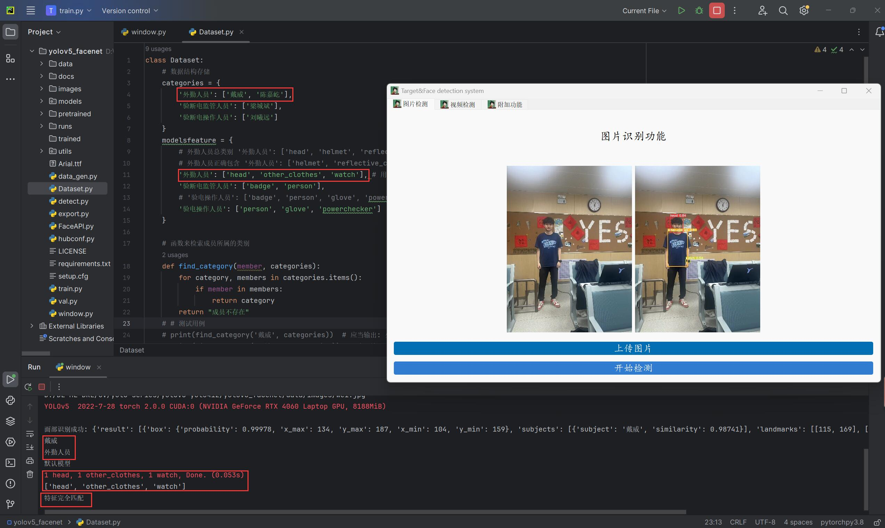
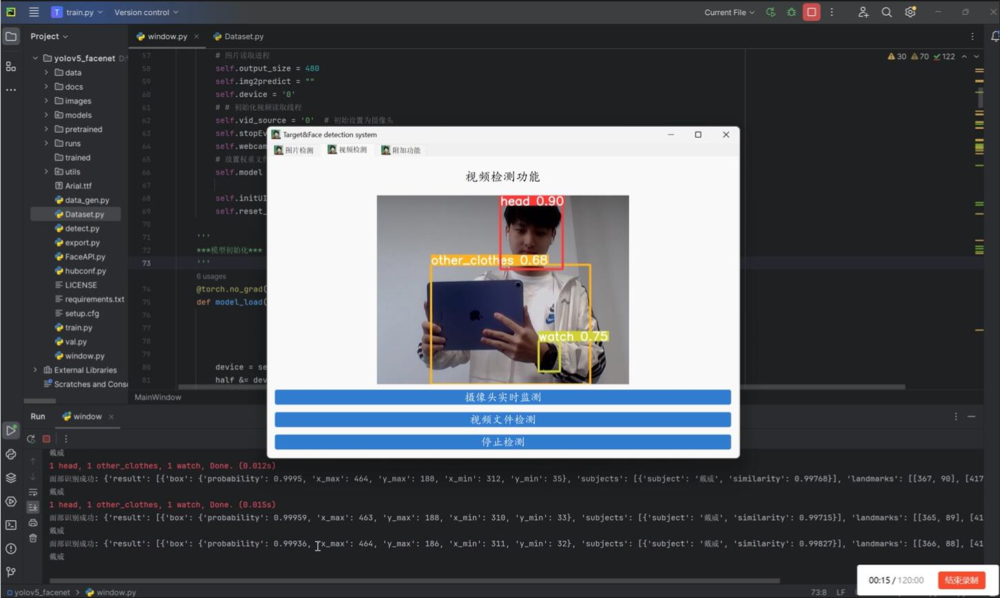
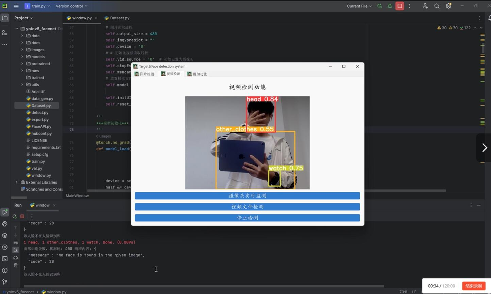
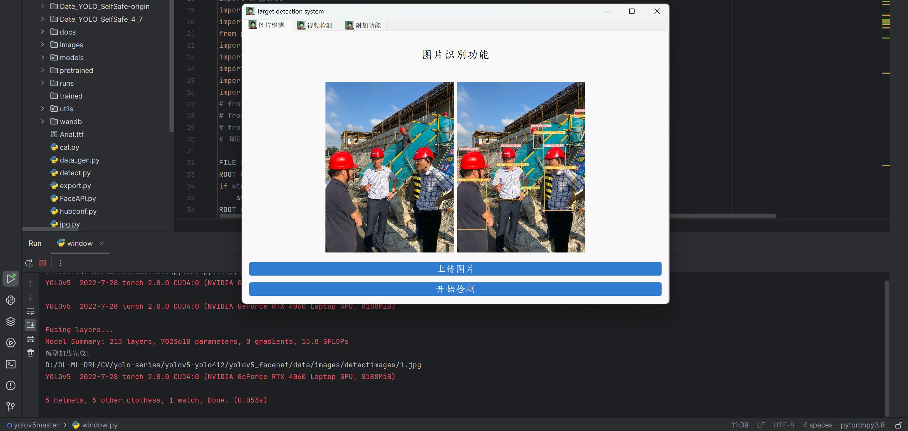
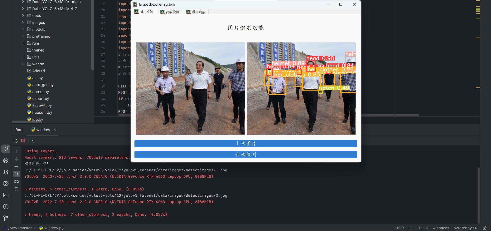
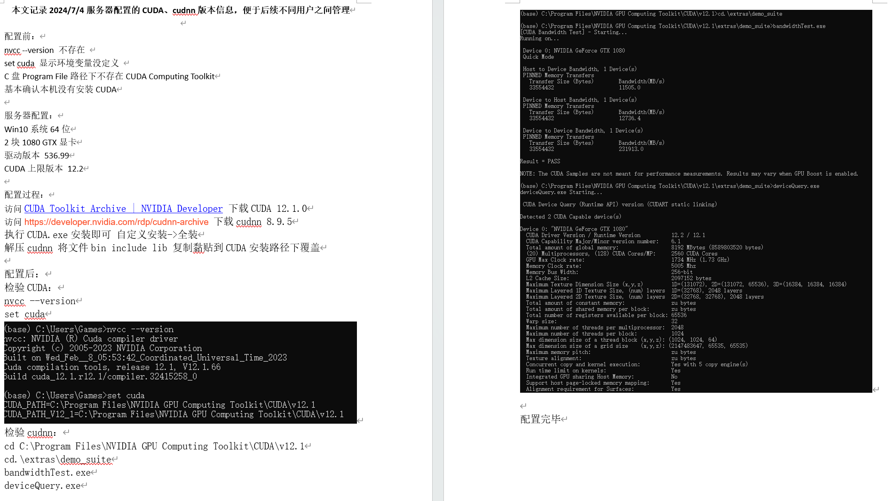
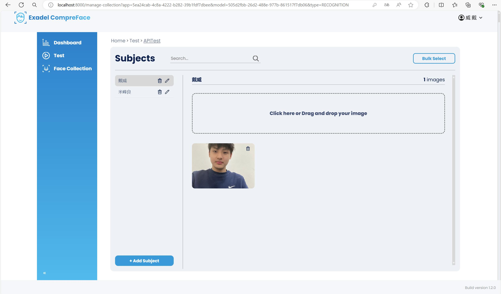

# Security-feature-detection-system 安全检测系统

## 简介
安全检测系统-多目标识别（YOLOv5）和人脸识别（Facenet）快速部署系统。功能上：本项目使用YOLOv5实现多目标识别，使用Facenet实现人脸识别，最终需要人脸和此人应具备的多目标同时满足才能通过安全检测，部署上：使用pyqt5实现前端可视化，在前端页面运行YOLOv5多目标识别系统（将模型运行封装到Qt中），使用Docker封装人脸识别后端系统，使用网络请求等包实现前后端交互 案例：进行多目标识别的同时，进行人脸识别，前端系统发送请求，携带参数到后端进行人脸识别，最终返回人脸识别结果，获取人脸识别结果后，检索该成员应具备的多目标特征，与YOLOv5多目标识别的实际结果进行比对，若无误则通过安全检测

## 项目背景
出于一些比赛的需要，以及逃离懵懂状态开始探索，我于2023.12~2024.1（大二上）开始一些CV、LLM项目的研究，苦于能力有限，当时大部分的项目都是依托开源搭建而来，诸如本项目就是依托开源的Compreface和Yolov5搭建，我只不过做了缝合的工作，所以在此必须提及这两个项目的巨大贡献：https://github.com/exadel-inc/CompreFace https://github.com/ultralytics/yolov5
今天是2024.7.11(大二下暑假)，时隔半年我才开始这个项目的开源工作是因为，半年前的水平有限，虽然自己能实现项目的运作，但是恐很多细节介绍不好，当然本文自发出，后续我还会跟进，欢迎指正：22012100039@stu.xidian.edu.cn，如果本文对大家有帮助，诚恳的请求投喂Star！

## 导儿！！！
如果您是因为我的邮件访问我的github，您有兴趣具体了解我的项目，可以回复我，我可以配置一下，挂载到外链给您访问，期待您的回信！

## 效果展示 Demo
（1）上传图片识别的结果（此时配置了人脸识别，多目标识别，人脸识别后，到数据库中找到对应的工种特征，进行多特征检验）

（2）实时视频识别检测（此时仅配置人脸识别和多目标识别）
人脸识别与Compreface后端匹配上：

人脸识别与Compreface后端匹配不上：（手动遮脸，实现非Compreface后端配置人员）

（3）外摄
人脸识别与Compreface后端匹配上：

人脸识别与Compreface后端匹配不上：（手动遮脸，实现非Compreface后端配置人员）

（4）多目标识别的其他识别结果


（5）提供我配置服务器Pytorch供参考

（6）Compreface本地启动的网页（这里我们用FaceAPI封装各种请求，实现让脚本执行命令）



## 人脸识别模块部署
系统使用Docker封装的Compreface实现人脸识别，localhost运行后，可以在网页进行操作，但是系统中需要通过官方API文档编写FaceAPI.py借助request等实现各种功能

1：首先进行Conpreface的本地部署（默认已经配置docker--自行检索）

```bash
# 下载Compreface项目--使用git bash
git init
git clone https://github.com/exadel-inc/CompreFace.git
# 下载Compreface项目--直接暴力download unzip
```

2：容器启动Compreface

```bash
# CPU推荐
cd ...\CompreFace
(以我的绝对路径为例：1.D: 2:cd D:\DL-ML-DRL\CV\FaceIdentify\compreface\CompreFace-master)
docker-compose up -d
# GPU推荐
cd ...\CompreFace\custom-builds\Mobilenet-gpu
(以我的绝对路径为例：1.D: 2:cd D:\DL-ML-DRL\CV\FaceIdentify\compreface\CompreFace-master\custom-builds\Mobilenet-gpu)
docker-compose up -d
```

3：Compreface url localhost 具体配置

三种功能：人脸识别、人脸分割、人脸比对

一种提高检测正确率的方法：人脸识别和人脸比对交叉融合

一种提高检测速度的方法：对传入图片先进行人脸分割，将分割后的图片传给识别和比对

其他具体的功能以及功能具体的操作自行查询文档

4：FaceAPI.py（此处只介绍部分操作函数）
参考Compreface的API开发文档封装的一系列操作函数：
 ```bash
创建subjectsdef CreateSubject(compre_face_base_url,api_key,subject_name):

获取所有subjects(def GetSubject(compre_face_base_url,api_key):) 

重命名指定subjects(def Rename(compre_face_base_url,api_key,subject_name,new_subject_name):)

删除subjects(def DeleteSubject(compre_face_base_url,api_key,subject_name):)

上传图片到subjects中(def UploadPicture(compre_face_base_url,api_key,subject_name,file_path):)

获取某个subjects所有上传的图片(def GetPicture(compre_face_base_url,api_key,subject_name):)

删除指定subject的所有图片(def DeleteSubjectPicture(compre_face_base_url,api_key,subject_name):)

Recognize人脸识别(def Recognize(compre_face_base_url,api_key,file_path,limit,det_prob_threshold,prediction_count,face_plugins,status):)
 ```
 (目前只开发人脸识别，后续根据库规模扩大，可以增加人脸比对进行双重检验)

 下面举例一个流程：
 ```bash
CreateSubject(compre_face_base_url,api_key,"米峰良")

UploadPicture(compre_face_base_url,api_key,"米峰良","D:/DL-ML-DRL/CV/FaceIdentify/compreface/FaceData/recognition/FaceTrain/米峰良.jpg")

recognize_result = Recognize(compre_face_base_url,api_key,"D:/DL-ML-DRL/CV/FaceIdentify/compreface/FaceData/recognition/FaceTest/米峰良Test1.jpg",0,"0.8",1,"landmarks",False)
 ```


## 多目标识别模型的部署
本项目提供的源码主要涉及对YOLOV5源码的调整，以及操作Compreface的API脚本，以及利用detect.py封装的Windows.py实现上传图片、上传视频、实时视频的检测输出

1：环境配置（推荐使用Anaconda管理环境）
```bash
conda create -n pytorchpy3.8 python==3.8.5
conda activate pytorchpy3.8
```
安装适配的pytorch（具体建议自行检索学习）（路径下我放了一个我当时配置实验室服务器pytorch的工程文档，仅供参考）# 这里举一个例子
```bash
conda install pytorch==1.8.0 torchvision torchaudio cudatoolkit=10.2 # GPU版本
conda install pytorch==1.8.0 torchvision==0.9.0 torchaudio==0.8.0 cpuonly #CPU版本
```
其他包的安装
```bash
pip install pycocotools-windows
pip install pyqt5
pip install labelme
```
requirment的安装 #cd到项目目录
```bash
pip install -r requirements.txt
```
2：训练、检验、测试模型 
train.py val.py detect,py
具体训练模型等过程由于相对基础和繁琐，本文不赘述，网上很多资源，大家自行学习

3：挂载权重文件到Windows.py中集成图片、视频识别 Import FaceAPI同时实现人脸识别
```bash
# 此处挂载我已经训练好的目标识别权重文件
self.model = self.model_load("runs/train/exp/weights/best.pt",device=self.device)  # todo 指明模型加载的位置的设备
# 当前数据集（train+valid）大概标注了五千张图片 目标为['head', 'helmet','reflective_clothes','other_clothes','watch']
# 当前数据集和一些其他任务的数据集，由于检索和标注过程时间成本过高，不无偿公开，需要的可以咨询我报价，有多个任务的数据集、训练好的权重文件、爬虫的脚本等，报价高，可以定制(战斗！爽
```
4：运行Windows.py实现系统运行
系统集成人脸识别、多目标识别，返回人脸识别结果、返回多目标识别结果

可以根据此完成以下目标：

（1）：构建工种-工作人员数据库，构建工种-工种特征数据库，建立关系型数据库（MySQL or Sqlite3），根据人脸识别的结果，检索数据库，获取当前工作人员应该具备的特征，将识别特征与需求特征进行比对。完成安全特征检测

（2）：提出一种模块化、智能化的多特征安全识别系统（涉密，暂时不展开）

## 扩展
正如你所见，项目的功能繁多，我的时间有限，实际上还有很多组合我并没有时间去编写一个十分完善的系统。后续如果有需求我会进一步编写完整，或者您可以fork下来，欢迎您


